[](https://developer.cisco.com/codeexchange/github/repo/chrivand/amp-mssp-events-to-snow)

# SecureX orchestration workflows: Cisco Secure Endpoint (AMP4E) and Cisco Umbrella MSSP customer events to SecureX incident and ServiceNow incident

> **NOTE:** This is sample code and needs to be tested properly before using in production! This takes some time to set up (30-45 min) but will run completely autonomous afterwards. 

This is a set of sample workflows to work with the MSSP environment of **Cisco Secure Endpoint** (formerly known as Advanced Malware Protection for Endpoints (AMP4E)) and **Cisco Umbrella**. It can obtain events from the various customers and create Securex and ServiceNow incidents based on these security events. When the incident in ServiceNow is closed, this will automatically close the SecureX incident too. Please watch a demo in this [Youtube video](https://youtu.be/hz21e7HlFbg).

## Index

1. [Features and flow](##features-and-flow)
2. [Installation steps](#installation-steps)
    1. [Import the first workflow to add encoded AMP API keys to table](#import-the-first-workflow-to-add-encoded-amp-api-keys-to-table)
    2. [Import the second workflow to create SecureX and ServiceNow incidents](#import-the-second-workflow-to-create-securex-and-servicenow-incidents)
    3. [Import the third workflow to retrieve AMP events](#import-the-third-workflow-to-retrieve-amp-events)
    4. [Import the fourth workflow to retrieve Umbrella events](import-the-fourth-workflow-to-retrieve-umbrella-events#)
    5. [Import the fifth workflow that is triggered when ServiceNow incident is closed](#import-the-fifth-workflow-that-is-triggered-when-servicenow-incident-is-closed)
    6. [Import the sixth workflow that sets a global variable containing the ID of the third workflow](#import-the-sixth-workflow-that-sets-a-global-variable-containing-the-id-of-the-third-workflow)
    7. [Testing and running the solution](#testing-and-running-the-solution)
3. [Notes](#notes)
4. [Author(s)](#authors)


## Features and flow
1. The **first** workflow ([MSSP-Add-AMP+UMB-Creds.json](https://raw.githubusercontent.com/chrivand/amp-mssp-events-to-snow/main/MSSP-Add-AMP+UMB-Creds.json)) will be able to obtain user input to add Cisco Secure Endpoint (AMP4E) and Cisco Umbrella API Credentials + customer name and store them base 64 encoded in a table. Please note that the credentials are base 64 encoded, however are stored in the global table variable. SecureX is secured with MFA, but this still needs to be taken into consideration. This workflow only needs to be run initially and every time you add a customer to your MSSP portal.

2. The **second** workflow ([MSSP-SecureX-and-ServiceNow-Incident.json](https://raw.githubusercontent.com/chrivand/amp-mssp-events-to-snow/main/MSSP-SecureX-and-ServiceNow-Incident.json)) will create a SecureX incident, as well as a ServiceNow incident. It will make sure the ServiceNow incidents has information to close the loop back to SecureX by closing the incident. Optionally this workflow is able to isolate the AMP host or move it to a Triage group. 

> **Note:** this workflow can be used to create incidents for other security event sources as well. Check out the input variables to see how to use it as child workflow.

3. The **third** ([MSSP-AMP-Trigger-5min.json](https://raw.githubusercontent.com/chrivand/amp-mssp-events-to-snow/main/MSSP-AMP-Trigger-5min.json)) and **fourth** ([MSSP-Umbrella-Trigger-5min.json](https://raw.githubusercontent.com/chrivand/amp-mssp-events-to-snow/main/MSSP-Umbrella-Trigger-5min.json)) workflows  will loop through these API keys and obtain the AMP and Umbrella events for the past 5 minutes. This workflow can be scheduled to run every 5 minutes (or otherwise). It is also possible to configure which events are deemed as important to retrieve. The suggestion is to retrieve only high priority events, such as events with a `HIGH` or `CRITICAL` severity (AMP) and `Command and Control` or `Cryptomining` events (Umbrella). These events indicate that a host is actually compromised, and thus need attention from the Security Operations Center. 

> **Note:** workflow 5 and 6 are optional, but recommended since it will connect ServiceNow back with SecureX. It does require some extra work to get setup...

4. The **fifth** workflow ([SET-SERVICENOW-RESPONSE-WF-ID.json](https://raw.githubusercontent.com/chrivand/amp-mssp-events-to-snow/main/SET-SERVICENOW-RESPONSE-WF-ID.json)) only needs to be run once initially. This workflow sets a global variable containing the ID of the second workflow. This is needed by ServiceNow (using an outbound API call) to run the fourth and final workflow of this solution.

5. The **sixth** workflow ([SERVICENOW-TO-AMP.json](https://raw.githubusercontent.com/chrivand/amp-mssp-events-to-snow/main/SERVICENOW-TO-AMP.json)) will be able to close the SecureX incident when the ServiceNow incident is closed. It will also optionally be able to stop the AMP host isolation and move the host back to its original group. The ServiceNow incident ID will be added to the SecureX incident to fully sync the 2 systems. This workflow will be called via an outbound API call from ServiceNow.

**SecureX (AMP event) incident in ServiceNow:**<br/>
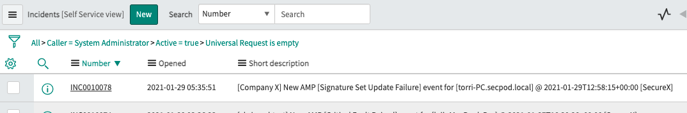

**SecureX (AMP event) incident in SecureX incident manager (in ribbon):**<br/>
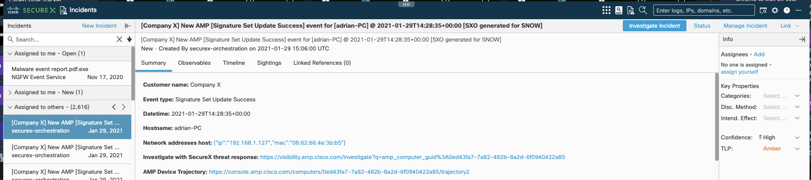

**Closing an incident in ServiceNow:**<br/>
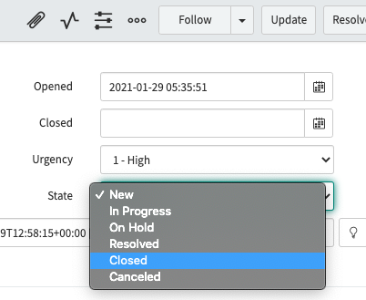

**Results in SecureX orchestration workflow to be run which also closes SecureX incident and adds ServiceNow reference:**<br/>
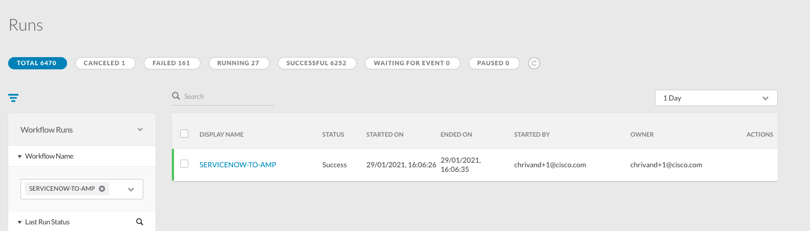


# Installation steps

> **Note:** Please read my very detailed explanation carefully. Plan around 30-45 minutes for this, incl. testing and coffee break... When getting into errors, it will be around targets in most cases. Please check if those are set correctly. Please import the workflows in the exact order as below, as workflows can be dependent on each other. Also, please import any required atomic workflows first, or you will get import errors.


# Import the first workflow to add encoded AMP API keys to table

## Required workflows, targets, accounts keys, global variables

* Main Workflow: [MSSP-Add-AMP+UMB-Creds.json](https://raw.githubusercontent.com/chrivand/amp-mssp-events-to-snow/main/MSSP-Add-AMP+UMB-Creds.json) 
* Global variable: **MSSP_api_creds** (generated when workflow is imported)

## Installation steps:

1. Browse to your SecureX orchestration instance. This wille be a different URL depending on the region your account is in: 

* US: https://securex-ao.us.security.cisco.com/orch-ui/workflows/
* EU: https://securex-ao.eu.security.cisco.com/orch-ui/workflows/
* APJC: https://securex-ao.apjc.security.cisco.com/orch-ui/workflows/

2. Browse to the **Workflows** section in the left pane menu.

3. Click on **IMPORT** to import the workflow:

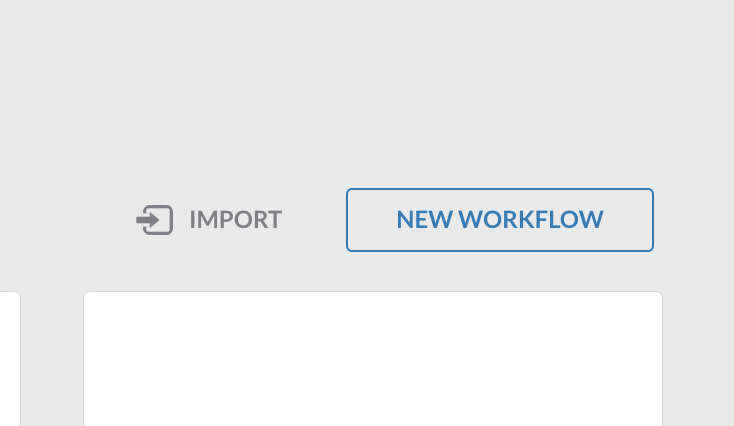

4. Click on **Browse** and copy paste the content of the [MSSP-Add-AMP+UMB-Creds.json](https://raw.githubusercontent.com/chrivand/amp-mssp-events-to-snow/main/MSSP-Add-AMP+UMB-Creds.json) file inside of the text window. 

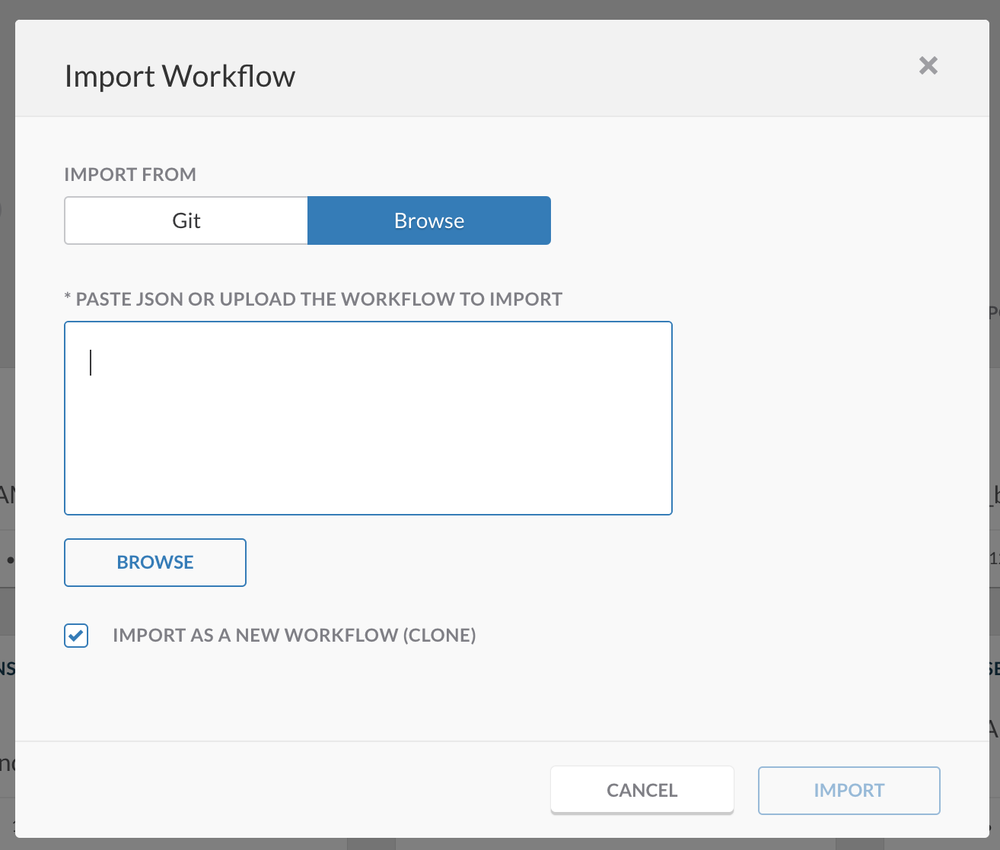

> **Note:** Alternatively you can also import this entire repository using Git. Please find instructions [here](https://ciscosecurity-sx-00-integration-workflows.readthedocs-hosted.com/en/latest/orchestration/import_export.html).

5. Click on **IMPORT**. You can now select the workflow and inspect it. Click **RUN** in the rop right corner: 

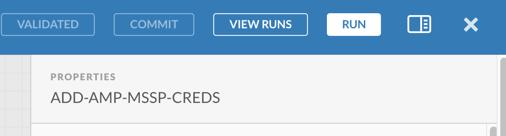

6. You will now be prompted to enter the `CUSTOMER NAME`, `AMP API CLIENT ID`, `AMP API CLIENT SECRET`, `UMBRELLA API KEY`, `UMBRELLA API KEY` and  `UMBRELLA ORG ID`. Run this workflow as many times as needed (as many times as you have customers or when you add a new customer).

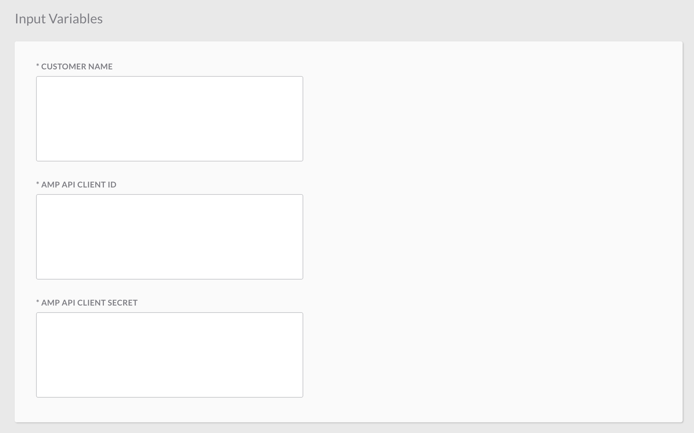

> **Note:** Please note that the credentials are base 64 encoded, however are stored in the global table variable. SecureX is secured with MFA, but this still needs to be taken into consideration.


# Import the second workflow to create SecureX and ServiceNow incidents

## Required workflows, targets, accounts keys, global variables

* Main Workflow: [MSSP-SecureX-and-ServiceNow-Incident.json](https://raw.githubusercontent.com/chrivand/amp-mssp-events-to-snow/main/MSSP-SecureX-and-ServiceNow-Incident.json)
* Atomic Workflow: Threat Response v2 - Generate Access Token
* Atomic Workflow: Threat Response v2 - Inspect for Observables
* Atomic Workflow: Threat Response v2 - Create Incident
* Atomic Workflow: Service Now - Create Incident
* Atomic Workflow: Service Now - Add Work Note to Incident
* Global Variable: **SNOW-RESPONSE-WF-ID** (generated when workflow is imported)
* Targets and Account Keys: **Private Intel Base**, **CTR API Target**, **ServiceNow**

> **Note:** all of the above atomic actions can be [imported here](https://ciscosecurity.github.io/sxo-05-security-workflows/importing) (if not already done automatically). Make sure that you import these first!

## Installation steps:

1. Browse to the **Workflows** section in the left pane menu.

2. Click on **IMPORT** to import the workflow.

3. Click on **Browse** and copy paste the content of the [MSSP-SecureX-and-ServiceNow-Incident.json](https://raw.githubusercontent.com/chrivand/amp-mssp-events-to-snow/main/MSSP-SecureX-and-ServiceNow-Incident.json) file inside of the text window. 


4. Click on **IMPORT**. You might receive an error that information is missing.

5. Click on **UPDATE** and fill in the CTR (SecureX threat response) and ServiceNow information. These are not stored as plain text, as they are stored as "secure strings" in SecureX.

> **Note:** To obtain the threat response API keys, create one here: https://securex.us.security.cisco.com/settings/apiClients. Please change the _.us._ in the url to _.eu._ or _.apjc._ respectively for the European or Asian instances. If you are using the EU or APJC instance, you will also need to change the target of the `CTRGenerateAccessToken` and `CTR Create Incident` activities in the workflow. You do this by clicking on the activity and scrolling to the `target` section. The SecureX Threat Response `client_id` is the target username, and the `client_secret` is the password. **Make sure to do this for all related CTR/Threat Response targets!** 

> **Note:** In the **Service Now - Create Incident** activity you will need to make some updates. You will need to create **ServiceNow basic auth credentials** and fill those in as account keys for the ServiceNow target. Also, you will need to change the target to domain of your ServiceNow instance. Lastly, you need to set the `SERVICE NOW USER ID`. This is the `user_id` of the user that is creating the incidents in ServiceNow (e.g. `admin`).


# Import the third workflow to retrieve AMP events 

## Required workflows, targets, accounts keys, global variables

* Atomic Workflows: **AMP - Move Computer to Group**
* Atomic Workflows: **AMP - Isolate Host**
* Child Workflow: [MSSP-SecureX-and-ServiceNow-Incident.json](https://raw.githubusercontent.com/chrivand/amp-mssp-events-to-snow/main/MSSP-SecureX-and-ServiceNow-Incident.json)
* Main Workflow: [MSSP-AMP-Trigger-5min.json](https://raw.githubusercontent.com/chrivand/amp-mssp-events-to-snow/main/MSSP-AMP-Trigger-5min.json)
* Targets and Account Keys: **AMP_Target** (no account keys!)
* Global variable: **MSSP_api_creds**

> **Note:** all of the above atomic actions can be [imported here](https://ciscosecurity.github.io/sxo-05-security-workflows/importing) (if not already done automatically). Make sure that you import these first!

## Installation steps:

1. Browse to the **Workflows** section in the left pane menu.

2. Click on **IMPORT** to import the workflow.

3. Click on **Browse** and copy paste the content of the [MSSP-AMP-Trigger-5min.json](https://raw.githubusercontent.com/chrivand/amp-mssp-events-to-snow/main/MSSP-AMP-Trigger-5min.json) file inside of the text window. 

4. Click on **IMPORT**. You might receive an error that information is missing.

5. Click on **UPDATE** and fill in the AMP Target and Account information

6. It is important to consider which events are deemed important for your MSSP offering. A recommendation is to use all events which require human investigation from your SOC.  You can find all `event_types` in the [AMP API docs](https://api-docs.amp.cisco.com/api_actions/details?api_action=GET+%2Fv1%2Fevent_types&api_host=api.amp.cisco.com&api_resource=Event+Type&api_version=v1). You will need to change the **Get recent High Priority events from AMP** action by changing the event types in the **RELATIVE URL**. Below is an example of all event_types which you might want to include. This is set as default in the current workflow:

`&event_type[]=1090519054&event_type[]=2164260880&event_type[]=2164260893&event_type[]=1090524040&event_type[]=1090524041&event_type[]=1090519084&event_type[]=1107296257&event_type[]=1107296258&event_type[]=1107296261&event_type[]=1107296262&event_type[]=1107296263&event_type[]=1107296264&event_type[]=1107296266&event_type[]=1107296267&event_type[]=1107296268&event_type[]=1107296269&event_type[]=1107296270&event_type[]=1107296271&event_type[]=1107296272&event_type[]=1107296273&event_type[]=1107296274&event_type[]=1107296275&event_type[]=1107296276&event_type[]=1091567670&event_type[]=1107296277&event_type[]=1107296278&event_type[]=1107296280&event_type[]=1107296281&event_type[]=1107296282&event_type[]=1107296284&event_type[]=1107296283&event_type[]=2164260931&event_type[]=1090519081&event_type[]=1090519105&event_type[]=1090519102&event_type[]=553648215`


# Import the fourth workflow to retrieve Umbrella events
## Required workflows, targets, accounts keys, global variables

* Atomic Workflow: **Umbrella - Reporting v2 - Get Activity** [imported here](https://ciscosecurity.github.io/sxo-05-security-workflows/importing)
* Atomic Workflow: **Umbrella - Reporting v2 - Get Token - MSSP Adjusted** [import here](https://raw.githubusercontent.com/chrivand/amp-umb-mssp-sxo/main/Umbrella%20-%20Reporting%20v2%20-%20Get%20Token%20-%20MSSP%20Adjusted.json)
* Main Workflow: [MSSP-Umbrella-Trigger-5min.json](https://raw.githubusercontent.com/chrivand/amp-mssp-events-to-snow/main/MSSP-Umbrella-Trigger-5min.json)
* Target: **Umbrella Management** (no account keys!), **Umbrella Reporting v2** (no account keys!)
* Global variable: **MSSP_api_creds**

## Installation steps:

1. Browse to the **Workflows** section in the left pane menu.

2. Click on **IMPORT** to import the workflow.

3. Click on **Browse** and copy paste the content of the [MSSP-Umbrella-Trigger-5min.json](https://raw.githubusercontent.com/chrivand/amp-mssp-events-to-snow/main/MSSP-Umbrella-Trigger-5min.json) file inside of the text window. 

4. Click on **IMPORT**. You might receive an error that information is missing.

5. Click on **UPDATE** and fill in the missing targets.

6. Please note that currently only blocked Cryptomining and Command and Control events (`verdict=blocked&categories=65,150`) are retrieved. This has been done because these 2 security events indicate compromised hosts. If needed this can be changed here in this atomic: **Umbrella - Get Blocked C2C + Cryptomining Activity**.


# Import the fifth workflow that is triggered when ServiceNow incident is closed

## Required workflows, targets, accounts keys, global variables

* Atomic Workflow: **Generate Access Token for SecureX**, **AMP - Move Computer to Group**
* Main Workflow: [SERVICENOW-TO-AMP.json](https://raw.githubusercontent.com/chrivand/amp-mssp-events-to-snow/main/SERVICENOW-TO-AMP.json)
* Target: **CTR API Target**, **AMP_Target**
* Account keys: **CTR_Credentials**
* Global variable: **MSSP_api_creds**, **SERVICENOW-RESPONSE-WF-ID**

## Installation steps:

1. Browse to the **Workflows** section in the left pane menu.

2. Click on **IMPORT** to import the workflow.

3. Click on **Browse** and copy paste the content of the [SERVICENOW-TO-AMP.json](https://raw.githubusercontent.com/chrivand/amp-mssp-events-to-snow/main/SERVICENOW-TO-AMP.json) file inside of the text window. 

4. Click on **IMPORT**. You might receive an error that information is missing.

5. Click on **UPDATE** and fill in the CTR (SecureX threat response) keys. 

6. Make sure this workflow has the **CATEGORY** of `response` in the workflow properties pane on the right. This should be configured already.

7. In the workflow editor window, click on the **Close SecureX incident and add SNOW ID** action and scroll to the **REQUEST BODY** section and replace `xxx` with you ServiceNow tenant, this makes sure the link works when you update the SecureX incident. This reference URL will allow you to go directly to the ServiceNow incident!

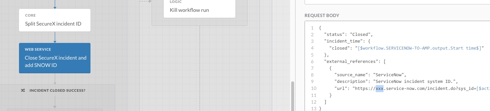

8. You will also need to set an [outbound REST web service in ServiceNow](https://docs.servicenow.com/bundle/paris-application-development/page/integrate/outbound-rest/concept/c_OutboundRESTWebService.html) and a [Advanced Business Rule in ServiceNow](https://docs.servicenow.com/bundle/paris-application-development/page/script/business-rules/concept/c_BusinessRules.html). This can be done using the extra **incident work note** that have been added by the second workflow. The second ServiceNow incident worknote will contain a relative URL that needs to be send as outbound REST request to SecureX using a REST POST method (this happens automatically, no action needed). The needed relative URL path for this is put in this second ServiceNow worknote. You will need to create an [OAuth profile](https://docs.servicenow.com/bundle/paris-application-development/page/integrate/outbound-rest/concept/c_OAuth2ProfileTutorialGoogle.html) using the SecureX API credentials that you have created earlier. The JSON object as shown below is embeddedin the URL and will be able to be used when the ServiceNow incident is closed.

```
{
  "observable_type": "file_path",
  "observable_value": {
    "servicenow-incident-id": "WILL-CONTAIN-SYS-ID",
    "amp-connector-guid": "WILL-CONTAIN-AMP-GUID",
    "amp-group-guid": "WILL-CONTAIN-AMP-GROUP-GUID",
    "securex-incident-id": "WILL-CONTAIN-SECUREX-ID",
    "customer-name": "WILL-CONTAIN-CUSTOMER-NAME"
  }
}
```

> **Note:** The needed relative URL path for this is now put in this second ServiceNow worknote. It is recommended to make this a hidden field, so that no one accidentally touches it. It works fine as is, but you might want to change this in production. That is up to the policies of your organization. 

9. Set up the **outbound REST web service** with the following specs:

* Name: **SecureX**
* Endpoint: https://visibility.amp.cisco.com/iroh/iroh-response/${url_to_send}

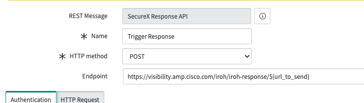

* In the Authentication tab under Authentication type: **OAuth 2.0**
* In the Authentication tab under **OAuth profile**: create a new profile containing:
    * Navigate to **System OAuth** > **Application Registry**.
    * Click **New**.
    * Select **Connect** to a third party OAuth Provider.
    * Enter a **Name** for the OAuth provider. For this example, use **SecureX**.
    * Enter the `Client ID` and `Client Secret` that you obtained from SecureX earlier, or create new API keys (might be better security wise).
    * Set the **Default Grant type** to **Client Credentials**.
    * In the **Authorization URL** field, enter: `https://visibility.amp.cisco.com/iroh/oauth2/authorize` (change region if needed)
    * In the **Token URL** field, enter: `https://visibility.amp.cisco.com/iroh/oauth2/token` (change region if needed)
    * In the **Redirect URL** field, enter: `https://<instance>.service-now.com/oauth_redirect.do` (this might be auto-filled)
    * In the **Token Revocation URL** field, enter: `https://visibility.amp.cisco.com/iroh/oauth2/app-grant/`
    * Right-click the form header and select **Save**.
    * A new **OAuth Entity Profile** record is created.
    * You can test if this works by clicking **Get OAuth Token**.
    
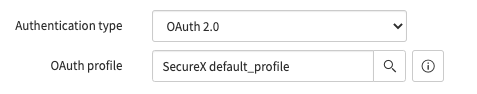
   
* Now click on the Default GET request and change the name to POST and the HTTP method to POST too. 


* In the HTTP Request tab, add 2 headers:
    * Name: `accept` Value: `application/json`
    * Name: `Content-Type` Value: `application/json`
* Click on **Auto-generate variables** and this automatically turns `${url_to_send}` into a Variable Substitution.
* Click on **Preview Script Usage** and copy paste the content. You will need this for the ServiceNow business rule that we are creating next!

    
10. Now set up a new **Advanced Business Rule**:

* Name: **SecureX close incident rule**
* Table: Incident [incident]
* Check the box for **Advanced**
* When to run: 
    * When: **before** and select the **Update** checkbox.
    * Add 2 conditions:
        * `State` `is` `Closed` AND
        * `Short description` `ends with` `[SecureX]`
        
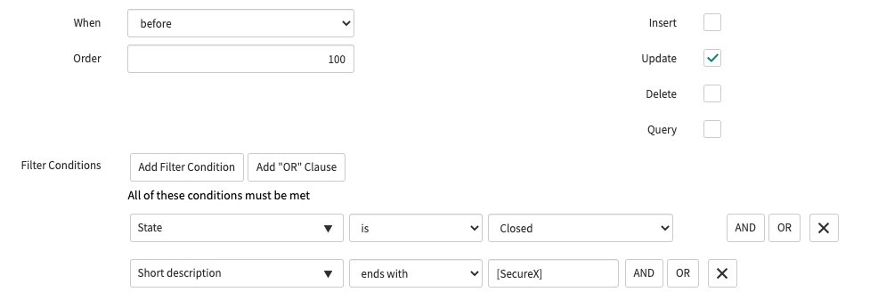

* Go to the **Advanced** tab and copy paste your **Script** here. Add two line before `line 3`, and change `line 3` to user the newly created `work_note_uri` variable:
```javascript
 var work_note_raw = current.work_notes.getJournalEntry(1);
 var work_note_uri = work_note_raw.split('\n');
 r.setStringParameterNoEscape('url_to_send', work_note_uri[1]);
```
* The total will now look like this:

```javascript
try { 
 var r = new sn_ws.RESTMessageV2('SecureX Response API', 'Trigger Response');
 var work_note_raw = current.work_notes.getJournalEntry(1);
 var work_note_uri = work_note_raw.split('\n');
 r.setStringParameterNoEscape('url_to_send', work_note_uri[1]);

//override authentication profile 
//authentication type ='basic'/ 'oauth2'
//r.setAuthenticationProfile(authentication type, profile name);

//set a MID server name if one wants to run the message on MID
//r.setMIDServer('MY_MID_SERVER');

//if the message is configured to communicate through ECC queue, either
//by setting a MID server or calling executeAsync, one needs to set skip_sensor
//to true. Otherwise, one may get an intermittent error that the response body is null
//r.setEccParameter('skip_sensor', true);

 var response = r.execute();
 var responseBody = response.getBody();
 var httpStatus = response.getStatusCode();
}
catch(ex) {
 var message = ex.message;
}
```

* Right-click the form header and select **Save**.

# Import the sixth workflow that sets a global variable containing the ID of the third workflow

## Required workflows, targets, accounts keys, global variables

* Atomic Workflow: **Generate Access Token for SecureX**, **List CTR response actions** 
* Main Workflow: [SET-SERVICENOW-RESPONSE-WF-ID.json](https://raw.githubusercontent.com/chrivand/amp-mssp-events-to-snow/main/SET-SERVICENOW-RESPONSE-WF-ID.json)
* Target: **CTR API Target**
* Account keys: **CTR_Credentials**
* Global variable: **SNOW-RESPONSE-WF-ID**

## Installation steps:

1. Browse to the **Workflows** section in the left pane menu.

2. Click on **IMPORT** to import the workflow.

3. Click on **Browse** and copy paste the content of the [SET-SERVICENOW-RESPONSE-WF-ID.json](https://raw.githubusercontent.com/chrivand/amp-mssp-events-to-snow/main/SET-SERVICENOW-RESPONSE-WF-ID.json) file inside of the text window. 

4. Click on **IMPORT**. You might receive an error that information is missing.

5. Click on **UPDATE** and fill in the CTR (SecureX threat response) keys.

6. After importing this workflow, you can open it and then click **RUN** in the top right corner. You will not have to use this workflow again after taking this action.

## Testing and running the solution

1. Now it is time to test the **AMP-MSSP-TO-SERVICENOW** workflow: click on **RUN** in the top right of your window, and everything should be working now. If not try troubleshooting by click on the activity that is colored red. 

> **Note:** If you are not getting any events, it might be that no high priority events happened in the last 5 minutes. If so, increase the amount of negative seconds in the **Calculate time 5 minutes ago** activity to something like 1 (86.400 seconds) or a couple of days. Also, so you can remove the `event_type` parameter from the relative URL from the **Get recent High Priority events from AMP** actvity. 

2. As a final step you could choose to enable to scheduled trigger for the [AMP-MSSP-TO-SERVICENOW.json](https://raw.githubusercontent.com/chrivand/amp-mssp-events-to-snow/main/AMP-MSSP-TO-SERVICENOW.json) workflow. This is recommended, as the workflow only retrieves the security events of the last 5 minutes. By scheduling it, the Security analysts will be updated every hour for potential new malicious activity. To enable the trigger, click on the hyperlink below and uncheck the `DISABLE TRIGGER` checkbox. This can be found in the workflow properties in the right menu pane. 

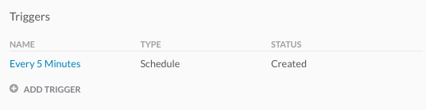

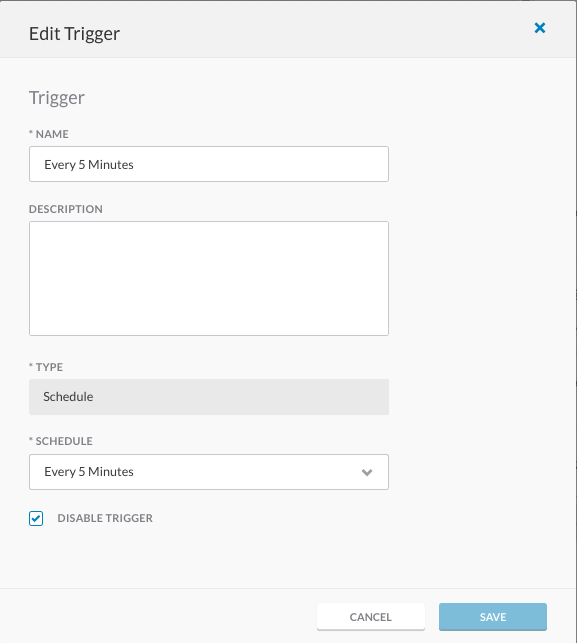

> **Note:** make sure not to select an activity when looking for the global workflow properties.

## Notes

* Please test this properly before implementing in a production environment. This is a sample workflow!
* The roadmap will include a webhook based trigger, instead of a scheduled run. 

## Author(s)

* Christopher van der Made (Cisco)
* Martin Meduna (ServiceNow)
